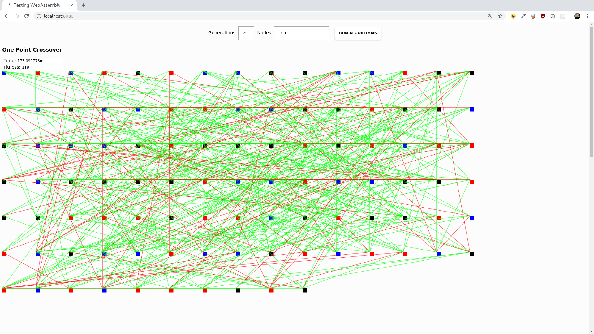

# go_webasm_coloring
Solution to the graph coloring problem using golang and webassembly

## Dependecies
* golang 1.11

## Get started
1. Clone repository
2. Then use the following command in the root folder: GOOS=js GOARCH=wasm go build -o main.wasm
3. Go into the server folder and run: go run server.go
4. Finally go to localhost:8080 to test the application

